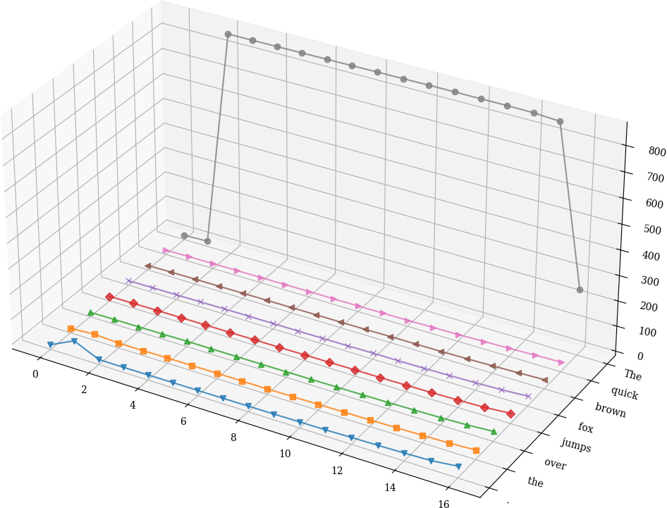
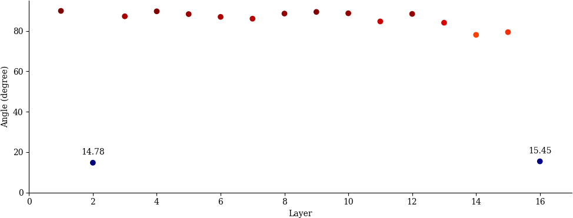
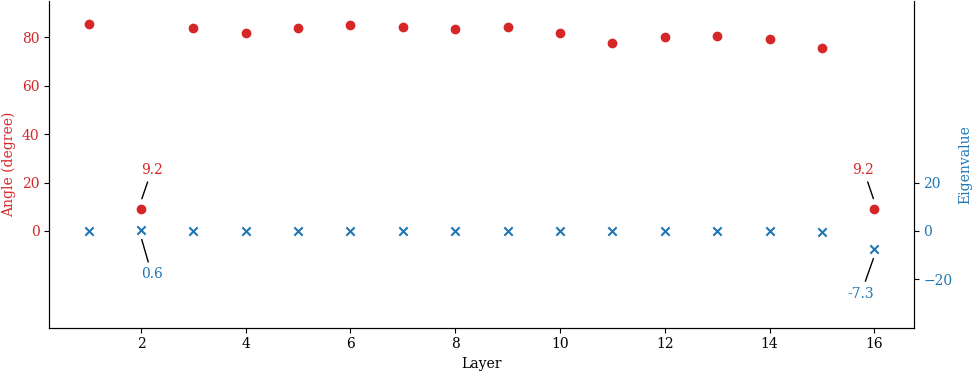
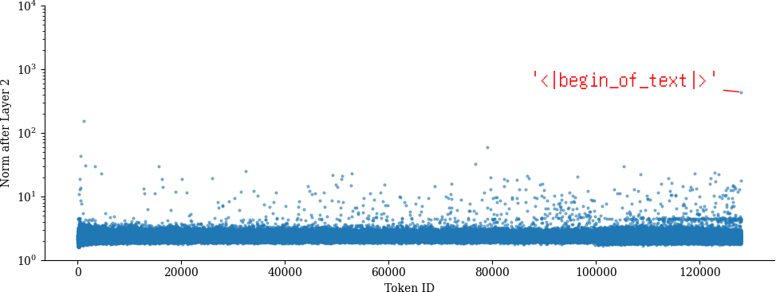
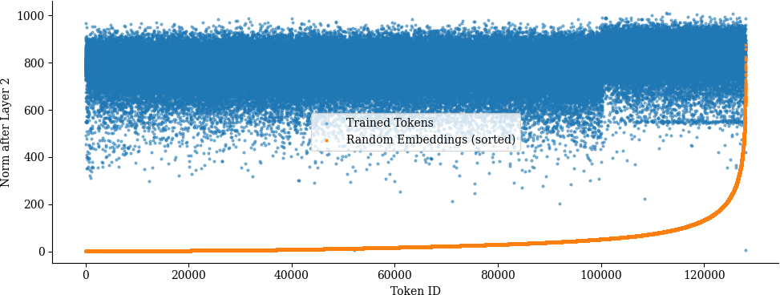
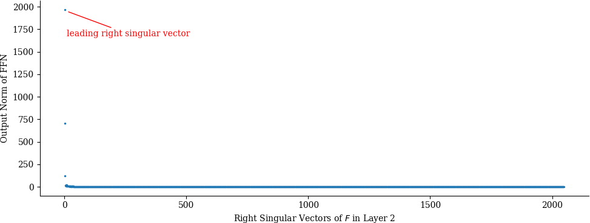
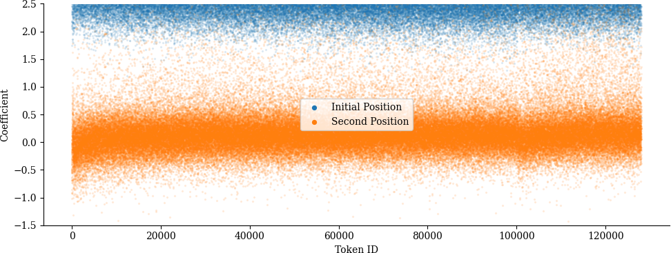

# Official Codes for "Demystifying Singular Defects in Large Language Models" (ICML 2025)

[](https://openreview.net/pdf?id=4yBnUokU2v)
[](https://www.youtube.com/watch?v=wBYxzaVaEYc)
[](./assets/singularllm-icml2025-poster.pdf)

## Install

```bash
conda create -n singular_defect python=3.12
conda activate singular_defect
pip install -e .
```

## Tools

### 1. Plot High Norms

```bash
./tools/plot_norm.py --model llama3.2_1b
```



### 2. Layer-Wise Singular Defect Direction Analysis

```bash
# compute singular defect directions
./tools/singular_defects.py --model llama3.2_1b
# by default, it saves to output/llama3.2_1b_sd.pth

# compute the empirical singular defect directions
./tools/singular_defects_empirical.py --model llama3.2_1b --thr 700 --pairwise_angle
# by default, it saves to output/llama3.2_1b_sd_empirical.pth

# visualize angles betweeen layer-wise singular defect directions and empirical singular defect direction
./tools/plot_angle.py --model llama3.2_1b --format png --annotate 2 16
```



### 3. Eigenvalue and Eigenvector Analysis

```bash
# compute eigenvalues and eigenvectors
./tools/eig.py --model llama3.2_1b
# by default, it saves to output/llama3.2_1b_eig.pth

# visualize eigenvalues and eigenvectors
./tools/plot_eig.py --model llama3.2_1b --annotate 2 16
```



### 4. Explosion Path Analysis

```bash
# compute noninitial high norm tokens
./tools/plot_noninitial.py --model llama3.2_1b --layer_id 1 --annotate 1
```



```bash
# compute initial high norm tokens
./tools/plot_initial.py --model llama3.2_1b --layer_id 1
```



### 5. Explosion Subspace Analysis

```bash
# explosion of norms for right singular vectors
./tools/plot_right_sv.py --model llama3.2_1b --layer_id 1
# by default, it saves to output/llama3.2_1b_right_sv.pth
```



```bash
# coefficients on the explosion subspace
./tools/plot_subspace_coef.py --model llama3.2_1b --layer_id 1
```



## Cite
```bibtex
@inproceedings{
wang2025demystifying,
title={Demystifying Singular Defects in Large Language Models},
author={Haoqi Wang and Tong Zhang and Mathieu Salzmann},
booktitle={Forty-second International Conference on Machine Learning},
year={2025},
url={https://openreview.net/forum?id=4yBnUokU2v}
}
```
## Acknowledgement

The code is built upon the great work of massive activations.

## More
